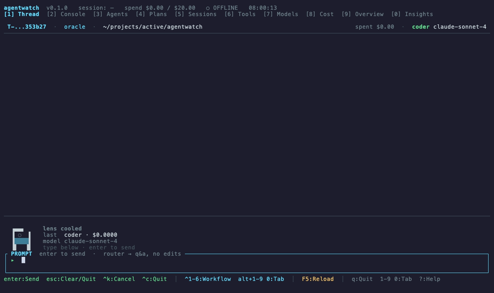

# AgentWatch

**The terminal you open when you want to actually run agents and see what they're doing.**

Single-host TUI for **driving and observing** agentic AI workflows. Sibling to [netwatch](https://github.com/matthart1983/netwatch) (network), [syswatch](https://github.com/matthart1983) (system), and [diskwatch](https://github.com/matthart1983) (disks) — same chrome, same palette, same hotkey bar.

Front-end to [neo](https://github.com/matthart1983/neo): one prompt drives the agents, the full instrument panel shows you what they're doing.


---

## Demo



> Submit a prompt → watch neo's agents work → see cost, model picks, and anomalies in real time. Without leaving the terminal.

---

## Why

Running multi-agent workflows in a terminal usually means streaming stdout and hoping you notice when something looks off. AgentWatch gives you **one prompt and the full instrument panel** on the same surface:

- **Driver mode** (tabs 1–2): the prompt is always one keystroke away
- **Observer mode** (tabs 3–0): live agent state, plan DAG, sessions, tools, models, cost, anomalies

The R2-style bot pulses while neo is thinking so the screen is never dead.

---

## Features

| Surface | What you get |
|---|---|
| **[1] Thread** | Minimal driver — full-width transcript, scanning-lens bot above the prompt |
| **[2] Console** | Full driver — HISTORY rail · WORKING transcript · PIPELINE rail · workflow picker |
| **[3] Agents** | 8 built-in neo agents, per-agent calls / cost / avg latency / last model |
| **[4] Plans** | Recent pipelines reconstructed from invocations, step-by-step |
| **[5] Sessions** | All threads sortable by recency, cost, model |
| **[6] Tools** | Tool-call rollups by agent + recent tool-using invocations |
| **[7] Models** | Leaderboard — calls / cost / p50 / p99 / success rate / spend bars |
| **[8] Cost** | Session / day / week / month gauges, by-model + by-agent bars, projection |
| **[9] Overview** | One-screen rollup — KPIs, agent strip, recent invocations, budget |
| **[0] Insights** | Rule engine — high latency, budget approach, model concentration, recent failures |

---

## Install

```bash
git clone https://github.com/matthart1983/agentwatch.git
cd agentwatch
cargo install --path .
```

Requires Rust 1.75+ and a working [neo](https://github.com/matthart1983/neo) install for the driver tabs to do anything useful.

### Locating neo

AgentWatch finds the `neo` binary in this order:

1. `$AGENTWATCH_NEO_BIN`
2. `which neo`
3. `~/projects/active/neo/target/release/neo`
4. `~/projects/active/neo/target/debug/neo`

---

## Quick start

```bash
agentwatch              # opens on [1] Thread
agentwatch --tab 9      # opens on [9] Overview
```

### Driver tabs (1, 2)

- Type a prompt — `Enter` submits, `Alt+Enter` adds a newline
- `Ctrl+1..6` picks a workflow preset (feature-build / bug-hunt / refactor / docs / review-only / oracle)
- Each submit spawns `neo <subcommand> "..."` based on the workflow and streams stdout/stderr back into the WORKING pane
- The R2 lens scans + hologram dots fade in while neo is thinking
- `Esc` clears the prompt; `Esc` again on an empty prompt quits

### Observer tabs (3–0)

- Plain digits switch tabs; on driver tabs use `Alt+<digit>`
- `↑/↓` or `j/k` navigates rows
- `F5` reloads the underlying state files

### Quit

`q` on observer tabs, `Esc` (twice) on driver tabs, `Ctrl+C` everywhere, `Ctrl+D` when the prompt is empty.

---

## How it works

AgentWatch is a **read-mostly** front-end. It tails three on-disk files that neo writes and writes one channel back:

```
~/Library/Application Support/neo/
├── threads/*.json         ← read   (every session neo has ever run)
├── invocations.jsonl      ← tail   (one line per agent call)
├── state.json             ← poll   (live tick — landing in upstream)
└── inbox/<uuid>.json      ← write  (control commands)
```

The boundary is a stable JSON contract in `src/data/contract.rs`. AgentWatch does not link against neo's crate — the two ship and release independently. A `neo-mock` runtime that writes plausible state can drive AgentWatch for testing without an API key.

When you hit Enter on a driver tab, AgentWatch also spawns `neo` as a subprocess so responses stream into the WORKING pane today — once the `ControlInbox` wiring lands upstream this is unnecessary and the inbox-file path becomes the single source of truth.

---

## Tech

- **Rust 1.75+** · single static binary
- **[ratatui](https://ratatui.rs)** 0.27 · **[crossterm](https://github.com/crossterm-rs/crossterm)** 0.27
- **[tui-textarea](https://github.com/rhysd/tui-textarea)** for the prompt
- **[tokio](https://tokio.rs)** for filesystem watching and subprocess management
- No web server, no daemon, no `sudo`

---

## Visual identity

Inherits the *Watch family palette:

| Token | Hex | Use |
|---|---|---|
| `bg` | `#0c1418` | Terminal background |
| `fg` | `#c5d1d6` | Default text |
| `green` | `#5cd989` | Healthy, success |
| `cyan` | `#5fdcff` | Active tab, primary accent, user prompts |
| `yellow` | `#f0c060` | Warnings, running agents |
| `red` | `#ff7878` | Errors, hard budget hits |

130 cols × 36 rows target, responsive ≥ 110×30.

---

## Status

Pre-1.0 — all 10 tabs render real data wherever the data layer supports it, with honest placeholders where neo upstream changes are still in flight. See [PLAN.md](PLAN.md) for the upstream PR list and per-PR follow-ups.

---

## License

MIT
